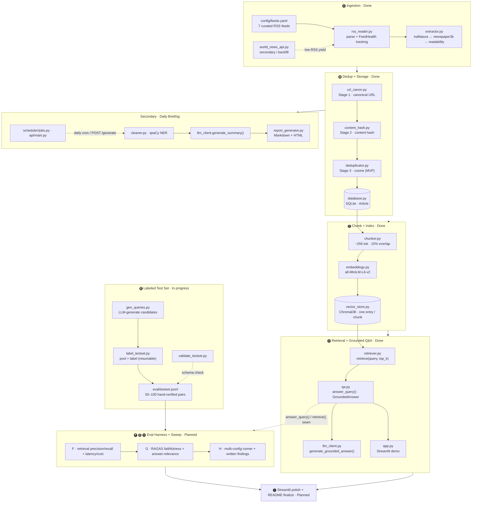

# FinNews-RAG — Project Flow & Ship Map

A financial-news pipeline that ingests free RSS feeds, deduplicates and stores
articles, indexes them as chunk-level embeddings, and answers questions with
**grounded, source-cited** responses — backed by a self-evaluation harness for
retrieval quality, faithfulness, and cost. A daily market-briefing generator is
retained as a secondary feature.

> This doc maps the whole roadmap. **Ships A–D are built** and already contain
> every main runtime component (ingestion → storage → chunk/index → retrieval →
> grounded Q&A). **Ships E–I are still on schedule** and are mostly the
> evaluation harness — the project's headline differentiator — plus demo polish.

## End-to-End Flow



**Two consumers of the corpus.** After dedup + storage, the pipeline forks:
the **RAG path** (C → D) chunks articles into ChromaDB and serves query-time
cited answers; the **briefing path** summarizes the day's articles directly into
a Markdown/HTML report. The briefing does **not** depend on ChromaDB.

## Ships → Components → Status

| Ship | Focus | Key components | Status |
|------|-------|----------------|--------|
| **A** | Ingestion overhaul — RSS-first, full-text extraction, source health | `config/feeds.yaml`, `ingestion/rss_reader.py`, `ingestion/extractor.py`, `ingestion/world_news_api.py` | ✅ Done |
| **B** | Dedup Stages 1–2 + DB wipe/rebuild | `processing/url_canon.py`, `processing/content_hash.py`, `processing/deduplicator.py`, `storage/database.py` | ✅ Done |
| **C** | Chunking + chunk-level embeddings in ChromaDB | `rag/chunker.py`, `processing/embeddings.py`, `storage/vector_store.py`, `database.get_unindexed_articles()` / `mark_indexed()` | ✅ Done |
| **D** | Retriever + grounded cited Q&A + Streamlit | `rag/retriever.py`, `rag/qa.py`, `llm_client.generate_grounded_answer()`, `app.py` | ✅ Done |
| **E** | Labeled test set (50–100 query/relevant-article pairs) | `eval/gen_queries.py`, `eval/label_testset.py`, `eval/validate_testset.py`, `eval/testset.jsonl` | 🚧 In progress |
| **F** | Eval harness pt.1 — retrieval P/R + latency/cost | `evaluation/harness.py`, `evaluation/metrics.py`, `evaluate.py` | 📋 Planned |
| **G** | Eval harness pt.2 — RAGAS faithfulness + answer-relevance | RAGAS integration in `evaluation/` | 📋 Planned |
| **H** | Multi-config comparison runner + written findings | config sweep over chunk size / top-k / embedding model | 📋 Planned |
| **I** | Streamlit polish + README finalize (stretch: signal extraction) | `app.py`, `README.md` | 📋 Planned |

## How the phases build on each other

- **A → B** — Ingestion produces normalized article dicts; dedup collapses
  duplicates (canonical URL, then content hash, then cosine) before they reach
  SQLite, so the same story from three feeds doesn't pollute retrieval.
- **B → C** — Stored articles flagged `indexed=False` get chunked (~256 tokens,
  the embedding model's real capacity) and written to ChromaDB one entry per
  chunk, keyed `{article_id}:{chunk_index}`.
- **C → D** — `retrieve()` embeds a query and pulls top-k chunks; `answer_query()`
  feeds them to the LLM under an "answer only from context" prompt and builds
  citations **from the retrieved chunks**, not the model — so a citation can be
  mis-numbered but never fabricated.
- **D → E–H** — `answer_query()` / `retrieve()` are the stable **seam** the eval
  harness scores. E builds the hand-verified ground truth; F–H measure retrieval
  P/R, faithfulness, and cost, then sweep configs (chunk size, top-k, embedding
  model) to find the best setup.
- **→ I** — Polish the Streamlit demo and finalize the README once the numbers
  from H are in.

## Why the remaining work matters

Ships A–D make the system *work*; Ships E–H make it *measured*. The evaluation
harness is the part that turns "a RAG demo" into "a RAG system with evidence" —
ground-truth retrieval metrics plus RAGAS faithfulness, compared across
configurations, with written findings. That comparison is the portfolio
differentiator the whole roadmap is pointed at.

## Tech Stack

| Layer | Technology |
|-------|-----------|
| Language | Python 3.11+ |
| Ingestion | RSS (`feedparser`) + trafilatura / newspaper3k / readability; World News API fallback |
| Storage | SQLite (SQLAlchemy) + ChromaDB (persistent) |
| Embeddings | `sentence-transformers/all-MiniLM-L6-v2` (local) |
| Generation | OpenAI `gpt-4o-mini` (structured output, `temperature=0`) |
| NLP | spaCy `en_core_web_sm` |
| Demo UI | Streamlit |
| Eval | Custom retrieval metrics + RAGAS (planned) |

## Quick Start

```bash
python -m venv .venv && .venv\Scripts\activate     # Windows
pip install -r requirements.txt
python -m spacy download en_core_web_sm
cp .env.example .env                               # add OPENAI_API_KEY (+ NEWS_API_KEY)

python main.py --mode run-once                     # build the corpus
streamlit run app.py                               # launch the RAG demo
```
